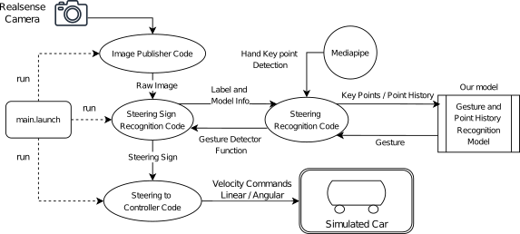
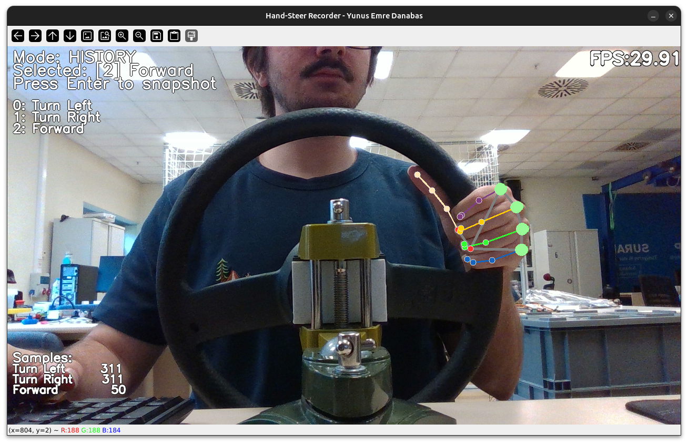

````markdown
# Hand-Steer-Sim  
**Real-Time Gesture Teleoperation for Mobile Robots**

> A **camera-only** hand-gesture interface that turns webcam / RealSense video into  
> `geometry_msgs/Twist` commands for differential-drive robots in **ROS Noetic**.

<div align="center">
  
</div>

---

## ✨ Features at a Glance

| ✔ | Capability | Notes |
|---|------------|-------|
| 🎥 **Vision-only** | Any 30 FPS webcam or Intel RealSense | No depth sensor or gloves |
| 🧠 **Dual-branch ML** | 1 k-param MLP (static) + 6 k-param LSTM (dynamic) | FP16 TFLite |
| ⚡ **Low latency** | **13 ms** end-to-end on RTX 4060 Ti (≈ 25 ms laptop CPU) | 30 FPS sustained |
| 📦 **One-command launch** | `roslaunch … sign_control.launch` | CPU & GPU Dockerfiles |
| 🔄 **Data→Model pipeline** | CLI recorder → notebooks → live test | Fully reproducible |
| 🕹️ **Gazebo + /cmd_vel** | Drop-in for any diff-drive robot | ROS topics only |

---

## 🚀 Quick Demo

```bash
# full camera ▶︎ gesture ▶︎ velocity ▶︎ Gazebo pipeline
roslaunch hand_steer_sim sign_control.launch \
           control_mode:=steering \
           show_image:=true
````

* **Static signs** – **Stop · Holding-Wheel · Speed-Up · Speed-Down** → linear velocity
* **Dynamic wheel gestures** – **Turn-Left(±) · Turn-Right(±) · Forward** → angular velocity

`/robot_diff_drive_controller/cmd_vel` carries the `Twist`, so you can keep the supplied Gazebo robot *or* drive any hardware that listens to the same topic.

---

## 📈 Performance Snapshot

| Hardware              | Decode (ms) | Inference (ms) | Display (ms) | **Total E2E (ms)** | FPS  |
| --------------------- | ----------- | -------------- | ------------ | ------------------ | ---- |
| **RTX 4060 Ti**       | 0.5         | **8.6**        | 4.0          | **13.2**           | 75.7 |
| ThinkPad E14 CPU      | 0.5         | 20.1           | 4.3          | 25.0               | 39.5 |
| ThinkPad E14 + Gazebo | 4.7         | 94.1           | 10.7         | 109.6              | 9.7  |

*Offline test-set accuracy: **99 % static** · **99 % dynamic***
(see `report/EE417_FinalReport_YunusEmreDanabas.pdf` for full confusion matrices).

---

## 📁 Repository Map

```text
hand_steer_sim/
├─ launch/            # camera + recognition + control (ROS launch files)
├─ scripts/           # Python ROS nodes & CLI tools
├─ model/             # ∟ static_mode/ (MLP) ∟ steering_mode/ (MLP+LSTM)
├─ data/              # CSV recordings (git-ignored)
├─ urdf/              # Gazebo robot model
├─ config/            # diff-drive controller params
└─ notebooks/         # training notebooks (Jupyter)
```

### CLI shortcuts (installed via `pip install -e .`)

| Command            | Purpose                                                      |
| ------------------ | ------------------------------------------------------------ |
| `hsim_camera_pub`  | Publish webcam / RealSense frames on `/image_raw`            |
| `hsim_record_data` | Full-screen GUI to capture labelled static & dynamic samples |
| `hsim_test_gest`   | Stand-alone live viewer for predictions (no ROS required)    |
| `hsim_hand_sign`   | ROS node – static gesture → `/gesture/hand_sign`             |
| `hsim_gest2twist`  | ROS node – static gesture → `/cmd_vel` (discrete)            |
| `hsim_steer_sign`  | ROS node – static + dynamic wheel gestures                   |
| `hsim_wheel2twist` | ROS node – fused steering → `/cmd_vel` (continuous)          |

---

## 🛠️ Installation

<details>
<summary>Native (Ubuntu 20.04 → 24.04, ROS Noetic)</summary>

```bash
# clone into a catkin workspace
cd ~/catkin_ws/src
git clone https://github.com/yunusdanabas/hand_steer_sim.git
cd ..

# ROS + Python deps
sudo apt install ros-noetic-cv-bridge ros-noetic-image-transport \
                 ros-noetic-tf2-ros ros-noetic-controller-manager
pip install -U pip
pip install -e src/hand_steer_sim[realsense]   # drop [realsense] if not needed

# build Gazebo plugins & messages
catkin_make
source devel/setup.bash
```

> **GPU delegate** – install `libtensorflow-lite-gpu2` and pass `use_gpu:=true` in the launch file for ≈ 2 × speed-up.

</details>

<details>
<summary>Docker (CPU & GPU)</summary>

```bash
# example GPU run (persists models & data)
docker run -it --rm --gpus all \
  --network host \
  -e DISPLAY=$DISPLAY -v /tmp/.X11-unix:/tmp/.X11-unix \
  -v $(pwd)/hand_steer_sim/model:/ws/src/hand_steer_sim/model \
  yunusdanabas/hand_steer_sim:gpu
```

</details>

---

## 🔄 Workflow · Collect → Train → Test → Deploy

| Stage      | Tool / Notebook                                                                                                | Output                         |
| ---------- | -------------------------------------------------------------------------------------------------------------- | ------------------------------ |
| **Record** | `hsim_record_data`                                                                                             | CSVs under `data/<timestamp>/` |
| **Train**  | `notebooks/keypoint_classification.ipynb` (static)<br>`notebooks/point_history_classification.ipynb` (dynamic) | `.tflite` models               |
| **Test**   | `hsim_test_gest`                                                                                               | Live overlay of predictions    |
| **Deploy** | `roslaunch hand_steer_sim sign_control.launch`                                                                 | Real-time control              |

<div align="center">
  
  <p><em>Figure&nbsp;2   One-click recorder GUI for building new datasets.</em></p>
</div>

---

## 🧑‍💻 Developer Essentials

* **Feature vectors** – 42-D wrist-normalised landmarks (static) · 128-D MCP history (dynamic)
* **Temporal smoothing** – dynamic IDs = majority vote across the last 16 frames
* **Safety clamps** – ±1 m s⁻¹ linear · ±2 rad s⁻¹ angular
* **Extending gestures** – add rows to your CSVs, retrain, drop new `.tflite` into `model/`

---

## 🔭 Roadmap

* Ackermann-steered robot support for more intuitive handling
* Two-handed gestures (lights, horn, emergency stop)
* User study on intuitiveness & fatigue

---

## 🤝 Acknowledgements

Solo capstone for **EE417 — Computer Vision (Spring 2025, Sabancı University)**.
Built on MediaPipe, TensorFlow Lite, ROS Noetic and Gazebo.

---

## 📜 License

> *No explicit license — feel free to fork, modify, and share.*

```
```
