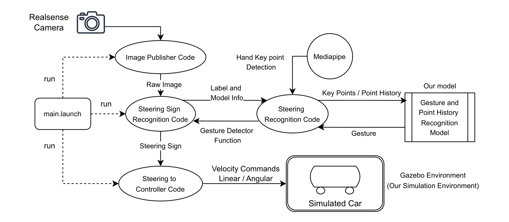
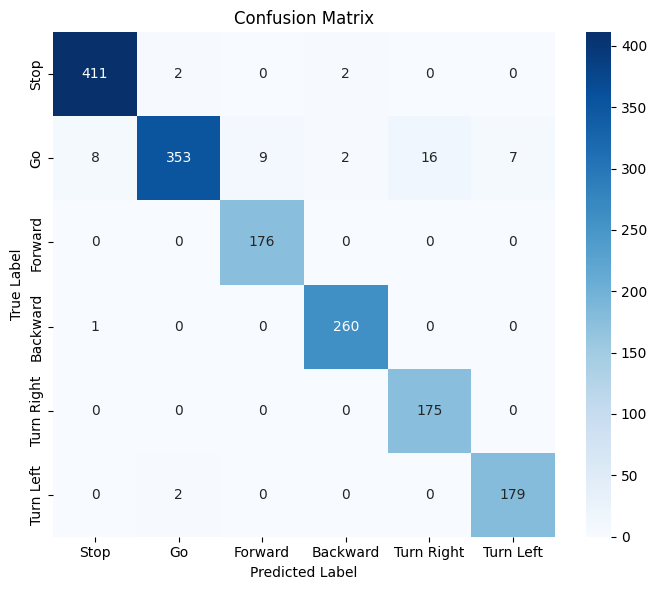
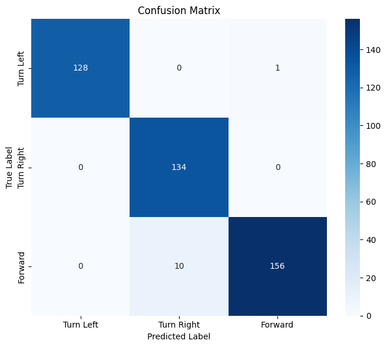

# Hand-Steer Sim

Vision-only gesture teleoperation: webcam or RealSense video becomes `geometry_msgs/Twist` commands for differential-drive robots on ROS Noetic.

**EE417 — Computer Vision (Spring 2025, Sabancı University)** · Solo capstone project.

A full write-up is available in the repo: [EE417 Final Report (PDF)](report/EE417_FinalReport_YunusEmreDanabas.pdf).



---

## Overview

Two control modes:

- **Static mode** — Single-frame hand signs (Stop, Speed Up, Speed Down, etc.) map to discrete Twist updates.
- **Steering mode** — "Holding Wheel" pose enables turn gestures (Turn Left, Turn Right, Forward); static gestures control speed.

MediaPipe hand tracking plus small TFLite models (MLP for static, LSTM for dynamic). Output goes to `/cmd_vel` for Gazebo or real robots.

---

## Quick Start

```bash
roslaunch hand_steer_sim sign_control.launch \
           control_mode:=steering \
           show_image:=true \
           use_gpu:=true
```

- `control_mode:=static` for discrete hand-sign only.
- `use_gpu:=true` uses TFLite GPU delegate when available.

---

## Topic Flow

| Node | Role |
|------|------|
| `hsim_camera_pub` | Camera to `/image_raw` |
| `hsim_hand_sign` | Static gestures → `/gesture/hand_sign` |
| `hsim_gest2twist` | `/gesture/hand_sign` → Twist (static mode) |
| `hsim_steer_sign` | Static + dynamic → `/gesture/steering_static`, `/gesture/steering_dyn` |
| `hsim_wheel2twist` | Both gesture topics → Twist (steering mode); turns only when Holding Wheel |

Default Twist topic: `/robot_diff_drive_controller/cmd_vel`.

---

## Gesture to Velocity

| Gesture | Linear (m/s) | Angular (rad/s) |
|---------|--------------|-----------------|
| Stop | 0 | 0 |
| Speed Up | +0.05 | — |
| Speed Down | −0.05 | — |
| Turn Left | — | +0.05 |
| Turn Right | — | −0.05 |
| Forward | — | no change |

Turn Left/Right apply only when **Holding Wheel** is active. Velocities are clamped (e.g. |v| ≤ 2 m/s, |ω| ≤ 2 rad/s).

---

## Models

- **Static**: 42-D wrist-normalized landmarks → MLP (~1.1k params) → 4 classes. TFLite FP16.
- **Dynamic**: 128-D (16 frames × 4 MCP joints × 2D) → LSTM (~6.4k params) → 3 classes. TFLite FP16.

---

## Results

**Accuracy (held-out test set):**

| Model | Accuracy | Macro-F1 |
|-------|----------|----------|
| Static MLP (4-class) | 99.65% | 1.00 |
| Dynamic LSTM (3-class) | 99.77% | 1.00 |

**Confusion matrices:**

| Static MLP | Stop | Hold | Up | Down |
|------------|-----:|-----:|---:|-----:|
| **Stop** | 464 | 0 | 0 | 0 |
| **Hold** | 0 | 125 | 0 | 0 |
| **Up** | 0 | 0 | 279 | 0 |
| **Down** | 0 | 0 | 1 | 287 |

| Dynamic LSTM | Left | Right | Forward |
|--------------|-----:|------:|--------:|
| **Left** | 128 | 0 | 0 |
| **Right** | 0 | 126 | 0 |
| **Forward** | 0 | 1 | 174 |

**Latency (960×540 @ 30 FPS, E2E = decode + inference + display):**

| Platform | Decode (ms) | Inference (ms) | Display (ms) | Total E2E (ms) | FPS |
|----------|------------:|---------------:|-------------:|----------------:|----:|
| RTX 4060 Ti (GPU) | 0.5 | 8.6 | 4.0 | **13.2** | 76 |
| ThinkPad E14 (CPU) | 0.5 | 20.1 | 4.3 | 25.0 | 39 |
| ThinkPad E14 + Gazebo | 4.7 | 94.1 | 10.7 | 109.6 | 9 |





---

## Installation

```bash
cd ~/catkin_ws/src
git clone https://github.com/yunusdanabas/hand_steer_sim.git
cd ../..
sudo apt install ros-noetic-cv-bridge ros-noetic-image-transport \
                 ros-noetic-controller-manager
pip install -e src/hand_steer_sim[realsense]
catkin_make && source devel/setup.bash
```

Docker (GPU example):

```bash
docker run -it --rm --gpus all --network host \
  -e DISPLAY=$DISPLAY -v /tmp/.X11-unix:/tmp/.X11-unix \
  -v $(pwd)/hand_steer_sim/model:/ws/src/hand_steer_sim/model \
  yunusdanabas/hand_steer_sim:gpu
```

---

## Repo Layout

- `launch/` — ROS launch (camera, recognition, control, Gazebo)
- `scripts/` — ROS nodes and tools
- `hand_steer_sim/model/` — static_mode (MLP), steering_mode (MLP + LSTM), notebooks
- `config/`, `urdf/` — Diff-drive and Gazebo config
- `data/` — Recorded CSVs (git-ignored)
- `report/` — [EE417 Final Report](report/EE417_FinalReport_YunusEmreDanabas.pdf) (PDF)

**CLI (after `pip install -e .`):** `hsim_camera_pub`, `hsim_record_data`, `hsim_test_gest`, `hsim_hand_sign`, `hsim_gest2twist`, `hsim_steer_sign`, `hsim_wheel2twist`.

---

## Data and Training

1. **Record** — `hsim_record_data` (GUI) → CSVs in `data/<timestamp>/`
2. **Train** — Notebooks in `hand_steer_sim/model/*/notebooks/` → `.tflite` and label CSVs
3. **Test** — `hsim_test_gest` (standalone) or full `sign_control.launch`


---

## License

No license restrictions — fork, modify, and share.
